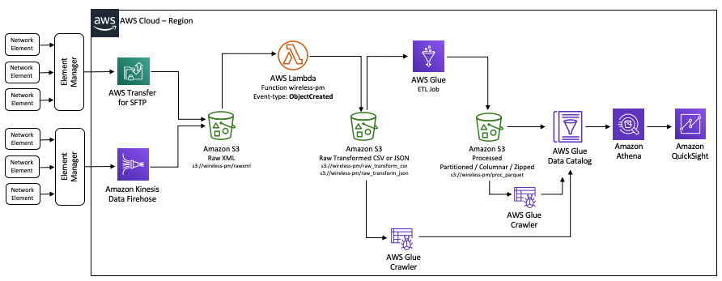
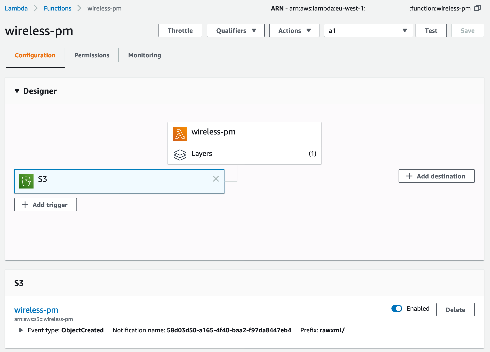
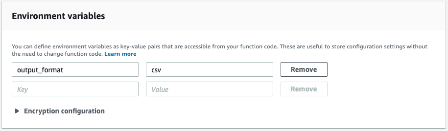

## Build a cloud-native network performance analytics solution on AWS for wireless service providers

This GitHub repository contains the code to support the AWS Big Data Blog post [Build a cloud-native network performance analytics solution on AWS for wireless service providers](https://aws.amazon.com/blogs/big-data/build-a-cloud-native-network-performance-analytics-solution-on-aws-for-wireless-service-providers/). It contains the Python code for the AWS Lambda described in the post and some example source (XML) and output (CSV, JSON) files.



### Collecting data using Amazon Kinesis Data Firehose or AWS Transfer for SFTP

For information about collecting PM files via element managers, see chapter 5 of [Technical Specification 3GPP TS 31.432](https://www.3gpp.org/ftp/tsg_sa/wg5_tm/TSGS5_122/SA_82/32432-f10.doc) on the 3GPP website.

Element managers act as collectors of XML measurement files that the network elements provide. They can send the files to an Amazon S3 bucket via Amazon Kinesis Data Firehose or AWS Transfer for SFTP.

### Transforming data using a Lambda function
The [Lambda function in this repository](lamdba/lambda_function.py) is written in Python 3.7 and it is associated with the ```ObjectCreated``` event type of the destination S3 bucket rawxml prefix (i.e. s3://wireless-pm/rawxml). We have created a [Lambda layer](https://docs.aws.amazon.com/lambda/latest/dg/configuration-layers.html) to resolve the dependency of the [xmltodict library](https://pypi.org/project/xmltodict/). The function runs every time a new XML file is saved in this location.



The function transposes the XML files, converts them into CSV or JSON (depending on the value set in the function’s ```output_format``` environment variable), and formats the files with one record per measurement (```measData```), measure type, and value (```measInfo```).




The [technical specification 3GPP TS 32.435 document](ftp://www.3gpp.org/tsg_sa/WG5_TM/TSGS5_68/_specs_for_checking/32435-900.doc) on the 3GPP website provides three example XML files in the Annex section. As an example, these are also included in this repository, together with the transformed output in CSV and JSON format.

| XML        | JSON           | CSV  |
|:-------------:|:-------------:|:-----:|
|[a1.xml](s3/examples/rawxml/a1.xml)|[a1.json](s3/examples/raw_transform_json/1574184589274_a1.json)|[a1.csv](s3/examples/raw_transform_csv/1574184547242_a1.csv)|
|[a2.xml](s3/examples/rawxml/a2.xml)|[a2.json](s3/examples/raw_transform_json/1574184593730_a2.json)|[a2.csv](s3/examples/raw_transform_csv/1574184542692_a2.csv)|
|[a3.xml](s3/examples/rawxml/a3.xml)|[a3.json](s3/examples/raw_transform_json/1574184597243_a3.json)|[a3.csv](s3/examples/raw_transform_csv/1574184532623_a3.csv)|

You can change the output field names in the ```get_record_header``` static method of the [GPPXml](lamdba/GPPXml.py) class defined in the Lambda function. The fields ```md_mi_meas_name``` and ```md_mi_meas_value``` contain the measure name and measure value, respectively.

The transformed CSV and JSON files are saved in the raw_transform_csv and raw_transform_json prefixes, respectively, in the S3 bucket (only one format is created for each execution, depending on the value of the output_format environment variable). The following screenshot shows the S3 bucket overview on the Amazon S3 console.

## License

This library is licensed under the MIT-0 License. See the LICENSE file.
